# Maestro-π UI Navigation Guide

Maestro-π ("Maestro-PI") is a Snowflake-native workflow orchestrator — think of it as an
tool that runs entirely inside your Snowflake account. It lets you schedule,
trigger, monitor, and debug Git-backed Python data pipelines ("DAGs") from a single web UI.

This guide walks through every screen in the app in the order you're likely to encounter them,
so if you're new to Maestro-π, read it top to bottom. If you already know the app, use the
headings below as a reference.

> Sign-in is handled entirely by Snowflake (SPCS ingress) — there is no username/password screen
> inside the app itself. Whoever opens the app URL from Snowflake is automatically identified;
> what they can *see and do* is then controlled by the roles an Admin has assigned them (more on
> this in [Admin & Permissions](#8-admin--permissions)).

---

## Table of Contents

1. [The Shell — Sidebar & Top Bar](#1-the-shell--sidebar--top-bar)
2. [Home / Dashboard](#2-home--dashboard)
3. [DAGs — the workflow list](#3-dags--the-workflow-list)
4. [DAG Detail Page](#4-dag-detail-page)
5. [DAG Run Detail Page](#5-dag-run-detail-page)
6. [Task Detail Panel](#6-task-detail-panel)
7. [Connections](#7-connections)
8. [Dead Letter Queue (DLQ)](#8-dead-letter-queue-dlq)
9. [Landing Times](#9-landing-times)
10. [Admin & Permissions](#10-admin--permissions)
11. [Assets (early / preview feature)](#11-assets-early--preview-feature)
12. [About](#12-about)
13. [Roles cheat-sheet](#13-roles-cheat-sheet)
14. [Not built yet](#14-not-built-yet)

---

## 1. The Shell — Sidebar & Top Bar

Every page in Maestro-π shares the same frame: a narrow icon **sidebar** on the left, and a
**top bar** across the full width. Only the middle content area changes as you navigate.

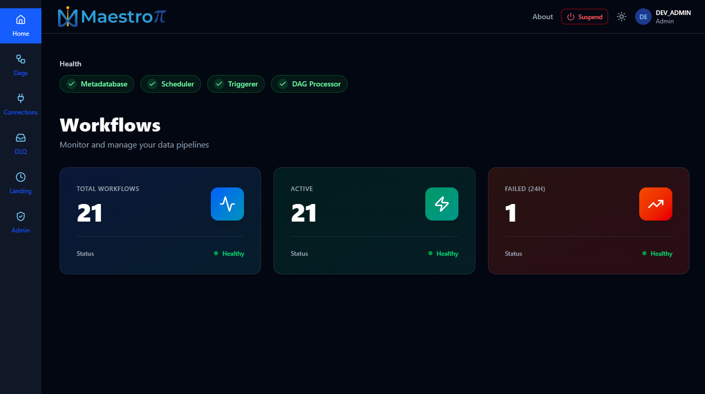

**Sidebar (left)** — one icon per section, always visible:

| Icon | Section | Goes to |
|---|---|---|
| 🏠 Home | Dashboard | `/` |
| 🔗 Dags | Workflow list | `/dags` |
| 🔌 Connections | External system credentials | `/connections` |
| 📥 DLQ | Dead Letter Queue | `/dlq` |
| 🕐 Landing | Landing Times | `/landing-times` |
| 🛡️ Admin | User & role management | `/admin` |

The **Admin** entry only appears if your account has the `Admin` role. **Connections** only
appears if your role grants `view` on connections. Everyone else just sees a shorter sidebar —
this isn't a bug, it's the permission system at work.

**Top bar (right side, left to right):**
- **About** — product/version info ([see §12](#12-about)).
- **Suspend** — a red button that stops the underlying Snowflake services for *everyone*. Only
  use this if you genuinely want to shut the app down; an admin has to resume it manually from
  Snowflake afterward.
- **☀/🌙 theme toggle** — switch between light and dark mode.
- **Avatar + username/role** — shows who you're signed in as and which role(s) you hold.

---

## 2. Home / Dashboard

The landing page (`/`) gives you an at-a-glance system status and a summary of your workflows.

- **Health strip** — green pills for each core service component (Metadatabase, Scheduler,
  Triggerer, DAG Processor). If one turns red/gray, something in the orchestration engine needs
  attention before you go debugging individual DAGs.
- **Workflows stat cards**:
  - **Total Workflows** — how many DAGs exist in the system.
  - **Active** — how many are *not* paused.
  - **Failed (24h)** — DAGs whose most recent run failed within the last day. This is your
    first stop when triaging "what broke overnight."

This page is read-only — it's a summary, not where you take action. For that, head to **Dags**.

---

## 3. DAGs — the workflow list

`/dags` is the master list of every workflow ("DAG") registered in Maestro-π, and where most
day-to-day work happens.

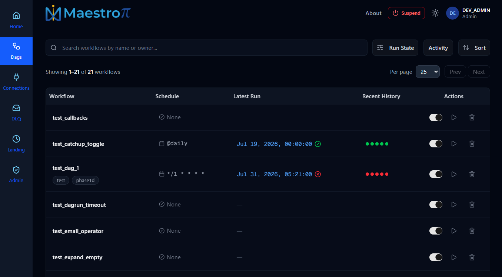

**Search / filter / sort bar** (top):
- **Search box** — filter by workflow name or owner.
- **Run State** — filter to only DAGs whose last run was `success`, `failed`, `running`, or
  `queued`.
- **Activity** — filter to only **Active** or only **Paused** DAGs.
- **Sort** — by name (A–Z / Z–A) or by last-run date (newest/oldest first).

**Table columns:**
- **Workflow** — the DAG's name and tags. Click the name to open its detail page.
- **Schedule** — the cron expression (hover for a plain-English description), or "None" if it's
  only triggered manually/via API.
- **Latest Run** — timestamp + a status icon (✓ success, ✗ failed, etc.) of the most recent run.
- **Recent History** — a row of colored dots showing the outcome of the last few runs at a
  glance — handy for spotting a DAG that flips between success/failure.
- **Actions**:
  - **Toggle switch** — pause/activate the DAG. A paused DAG will not run on its schedule and
    cannot be triggered until reactivated.
  - **▶ Play icon** — trigger a manual run immediately (disabled while paused).
  - **🗑 Trash icon** — permanently delete the DAG *and all of its run history*. If the DAG's
    source file still lives in the connected Git repo, Maestro-π will simply recreate it (with a
    clean history) the next time that file changes.

Pagination controls (rows-per-page, Prev/Next) sit just above the table.

> Some of these actions are permission-gated — a Viewer, for example, won't see the trigger or
> delete buttons at all.

---

## 4. DAG Detail Page

Clicking any workflow name opens its detail page (`/dags/<id>`) — this is where you inspect a
single pipeline in depth: its schedule, code, run history, and task graph.

### Header

Every tab on this page shares the same header showing the DAG's key metadata:

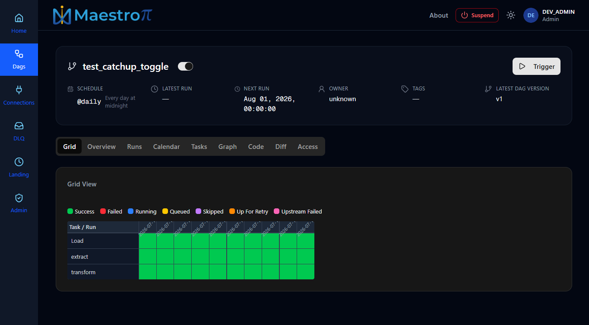

- **Name + on/off switch** — pause/activate this specific DAG (same as the list-page toggle).
- **Trigger button** — manually start a new run of this DAG right now.
- **Schedule** — the cron expression plus a human-readable translation.
- **Latest Run / Next Run** — timestamps, with a status icon on the latest one.
- **Owner**, **Tags**, **Latest DAG Version** — metadata about the current file/version.

### Triggering a run

Click **Trigger** to open the trigger dialog. If the DAG accepts runtime parameters, they're
shown here as a form; if not, you'll see a simple confirmation that it will run with defaults.

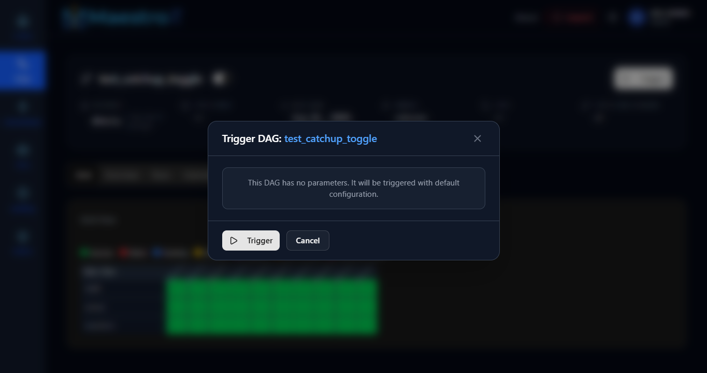

Click **Trigger** to confirm — the new run kicks off immediately and the Grid view below
refreshes automatically to show it in progress:

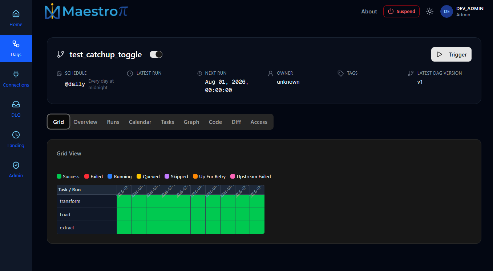

### The nine tabs

Below the header sits a row of tabs. Here's what each one is for:

#### Grid
A compact heatmap: one row per task, one column per recent run, colored by outcome. It's the
fastest way to see "has this task been failing lately?" across many runs at once.

Legend: 🟩 Success · 🟥 Failed · 🟦 Running · 🟨 Queued · 🟪 Skipped · 🟧 Up for Retry · 🟪 Upstream Failed

#### Overview
The DAG's static metadata in one place: DAG ID, active/paused status, owner, schedule, latest
version, next run, start date, source file path, tags, and a rendered description (if the DAG
defines one).

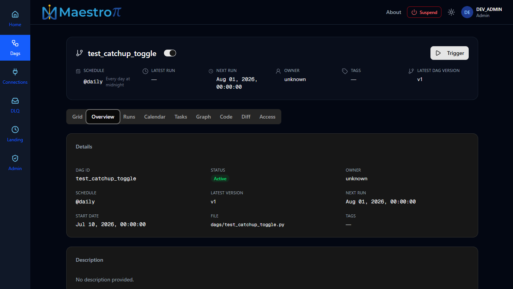

#### Runs
A reverse-chronological list of every run of this DAG, each showing start/end time, duration,
any run parameters (hover the "Params" pill), and how long ago it ran. Click a run to open its
[Run Detail Page](#5-dag-run-detail-page).

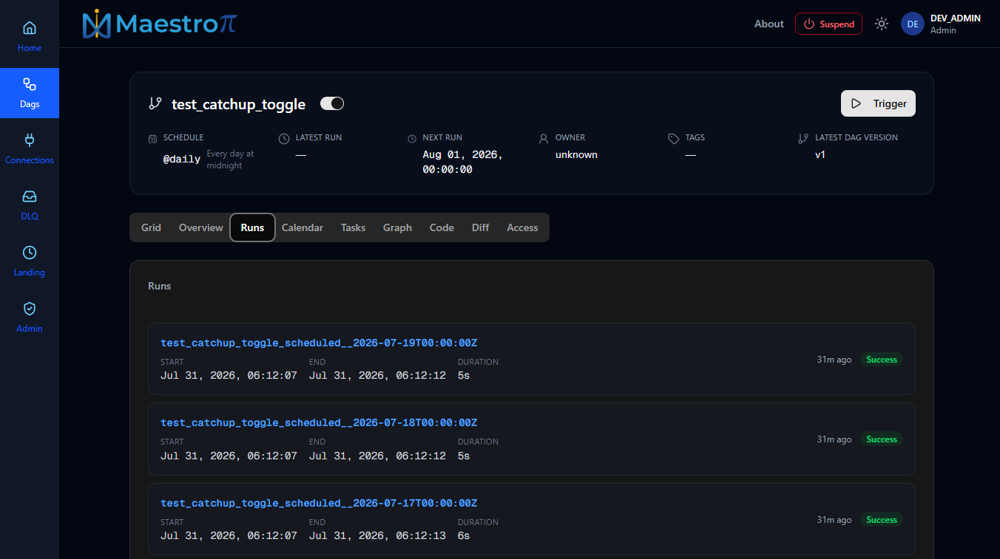

#### Calendar
A month-view calendar where each day with runs shows colored dots for their outcomes — useful
for spotting patterns like "this DAG always fails on weekends."

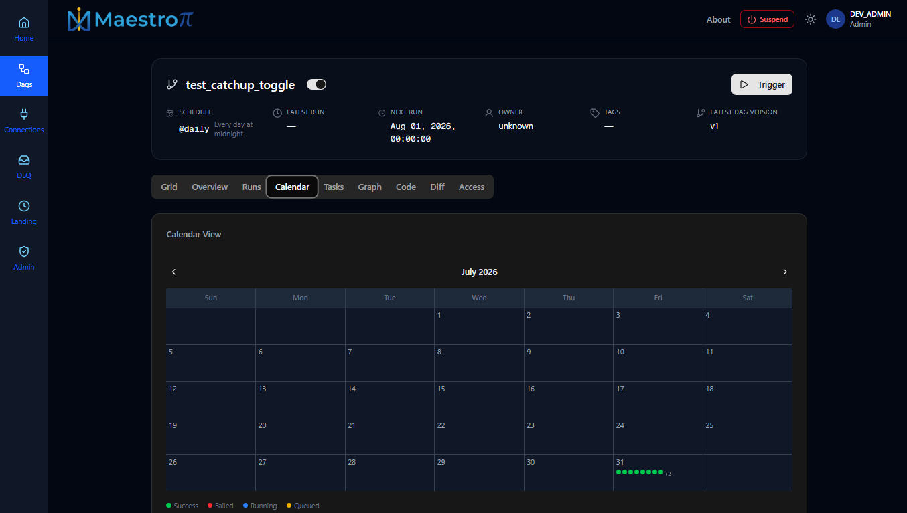

#### Tasks
The static list of tasks that make up this DAG — operator type, trigger rule, retry count, and
the state/time of each task's most recent execution.

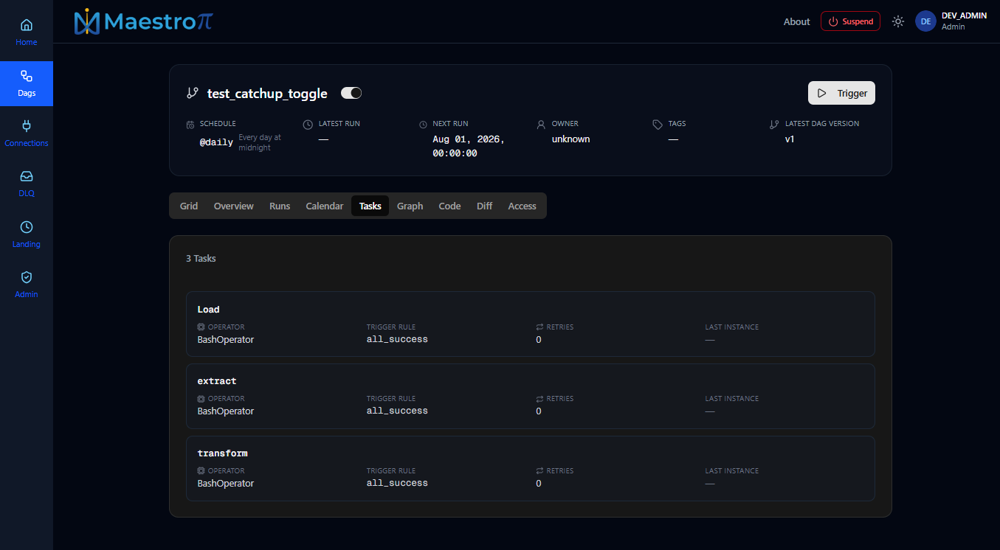

#### Graph
A visual node graph of task dependencies — arrows show which tasks must finish before the next
one starts. Good for understanding a pipeline's shape at a glance.

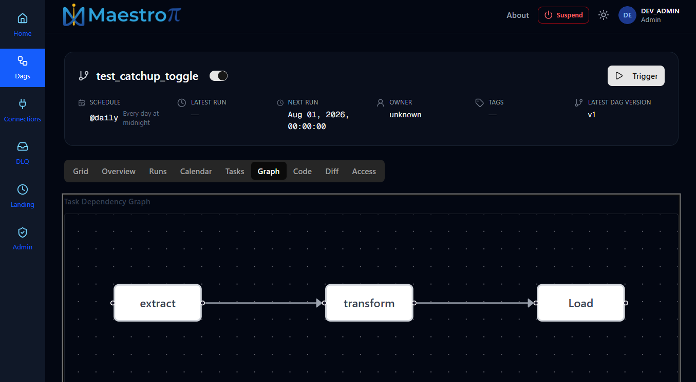

#### Code
The actual Python source file defining this DAG, syntax-highlighted (switchable between a dark
and light theme). This is pulled live from the connected Git repository.

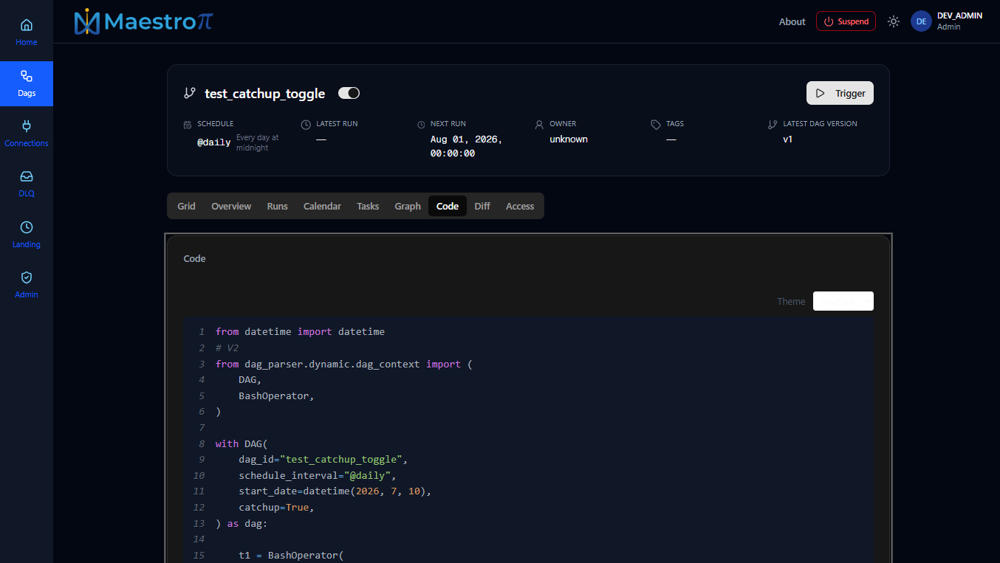

#### Diff
Compares the currently-deployed code against a previous version, with additions/removals
highlighted — useful for answering "what changed since this DAG last worked?"

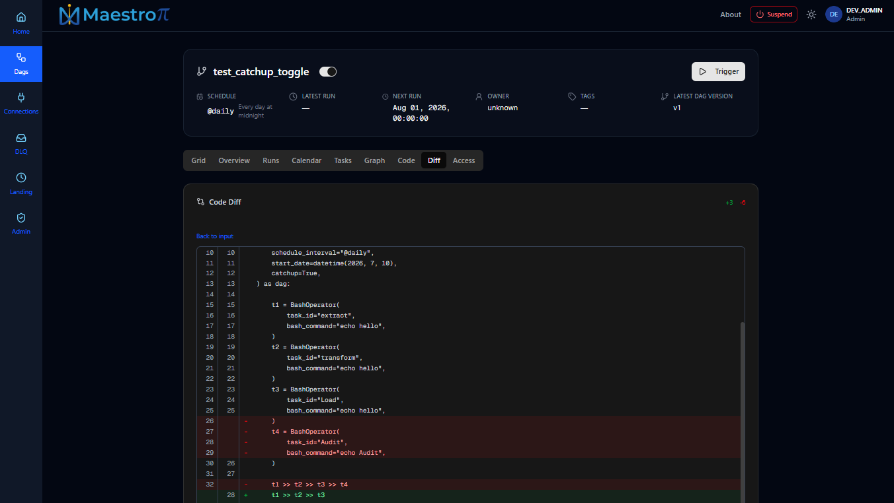

#### Access
Per-DAG permission overrides — grant a specific role extra access to *this one DAG* beyond what
their role normally allows (e.g. give the `Viewer` role `trigger` rights on just one pipeline).
Only Admins can add/remove entries here.

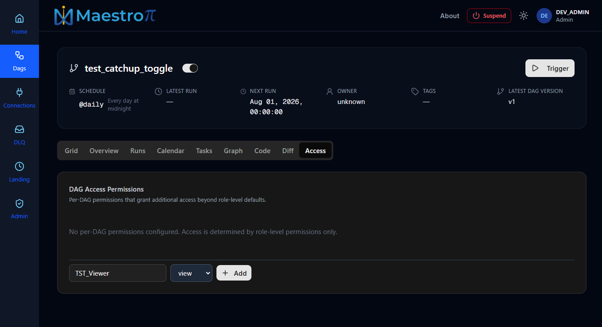

---

## 5. DAG Run Detail Page

Clicking a specific run (from the Runs tab, DLQ, or Landing Times) opens `/dags/<id>/runs/<runId>`
— a deep dive into that one execution.

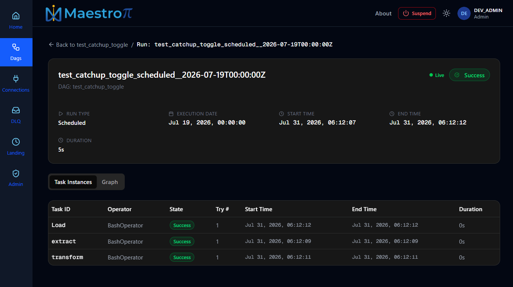

The header shows the run's type (scheduled/manual), execution date, start/end time, duration,
and overall state. A **Live** indicator appears when the run is actively in progress — the page
updates in real time via WebSocket (with a polling fallback) so you can watch tasks turn green
without refreshing.

Two tabs:
- **Task Instances** — a table of every task in this run: state, try number, timing, duration.
  **Click any row to open the [Task Detail Panel](#6-task-detail-panel).**
- **Graph** — the same dependency graph as the DAG's Graph tab, but colored by *this run's*
  actual task outcomes instead of static structure.

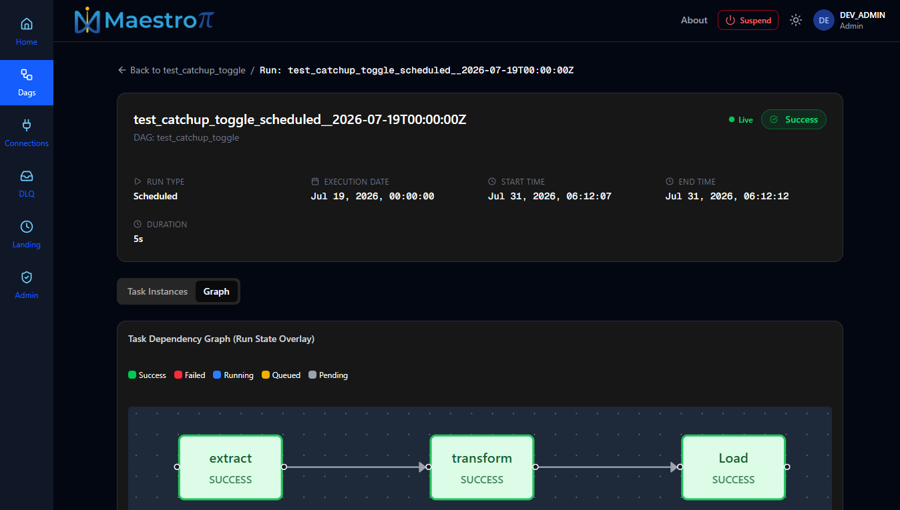

---

## 6. Task Detail Panel

Clicking a task row (on the Run Detail page) slides in a side panel with everything about that
one task instance, plus the ability to act on it:

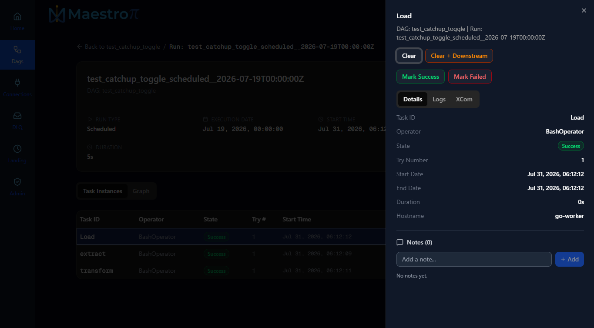

- **Clear** — reset the task so it re-runs.
- **Clear + Downstream** — reset this task *and* everything that depends on it.
- **Mark Success / Mark Failed** — manually force a state without re-running (useful when you've
  fixed something outside the pipeline and just need the DAG to reflect reality).
- **Details / Logs / XCom tabs** — Details shows operator, timing, hostname; Logs shows the
  task's execution output; XCom shows any data the task passed to downstream tasks.
- **Notes** — a free-text field for leaving comments on this specific task run (e.g. "restarted
  manually after upstream outage") — visible to anyone who opens this task later.

---

## 7. Connections

`/connections` manages credentials for external systems your DAGs need to talk to (databases,
cloud storage, messaging, compute).

### Catalog

The landing page groups available platform types by category:

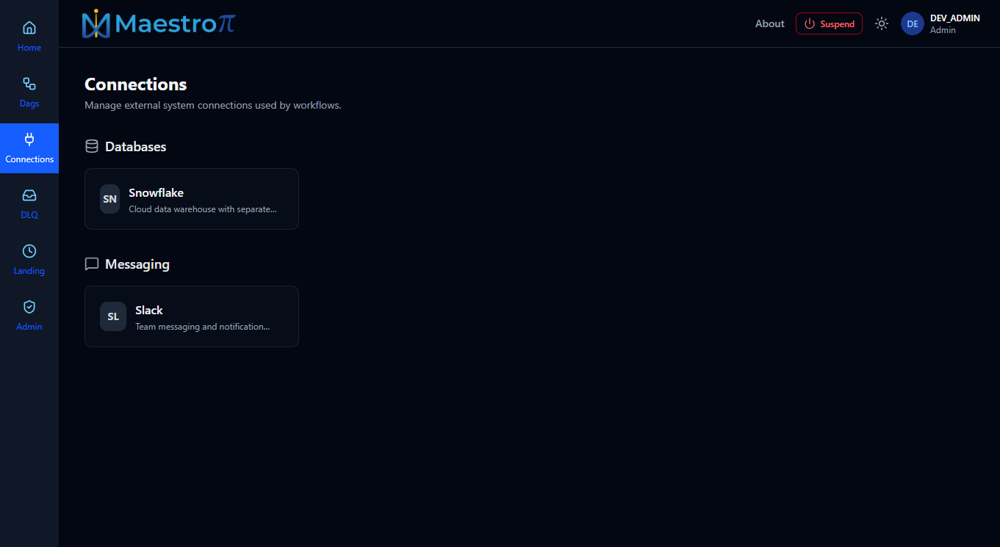

A badge on each card shows how many connections of that type already exist. Click a platform to
see (or add) its connections.

### A platform's connection list

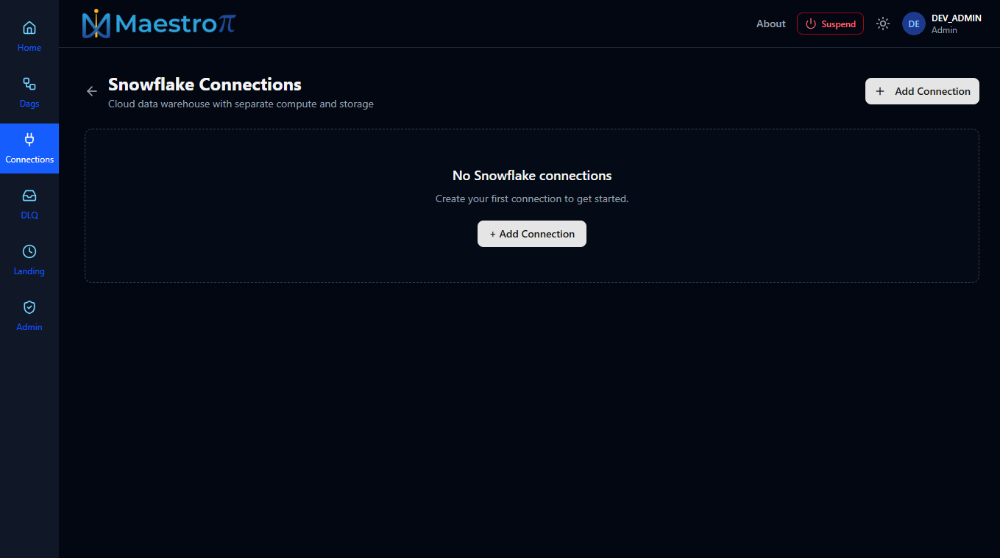

Before any connections exist, you get a prompt to add the first one. Once you've created a few:

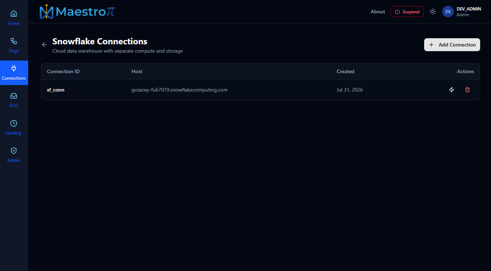

Each row has a **⚡ test** button (verifies the connection works right now, without leaving the
page) and a **🗑 delete** button.

### Creating a connection

Click **Add Connection** to open the form (`/connections/new`). Pick a platform from the
dropdown — the form fields adapt to what that platform needs.

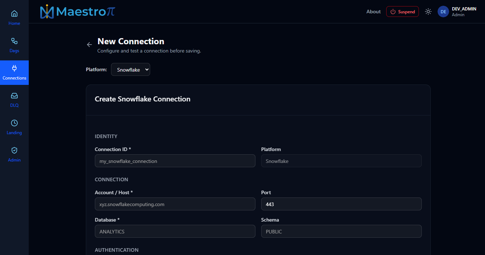

Scrolling down reveals authentication and advanced options (these vary by platform — Snowflake,
for example, asks for an authenticator method, token, warehouse, and role):

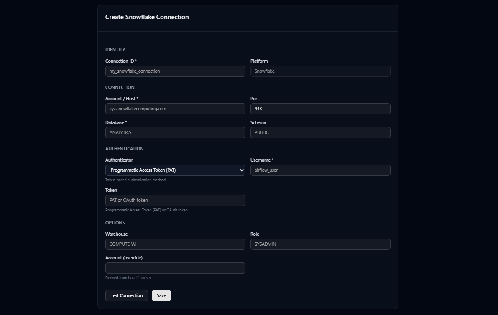

Always click **Test Connection** before **Save** — it's a free way to catch a typo'd hostname or
expired token before it breaks a live pipeline.

### Editing a connection

Click a connection's ID from its list to edit it later — the same form, pre-filled:

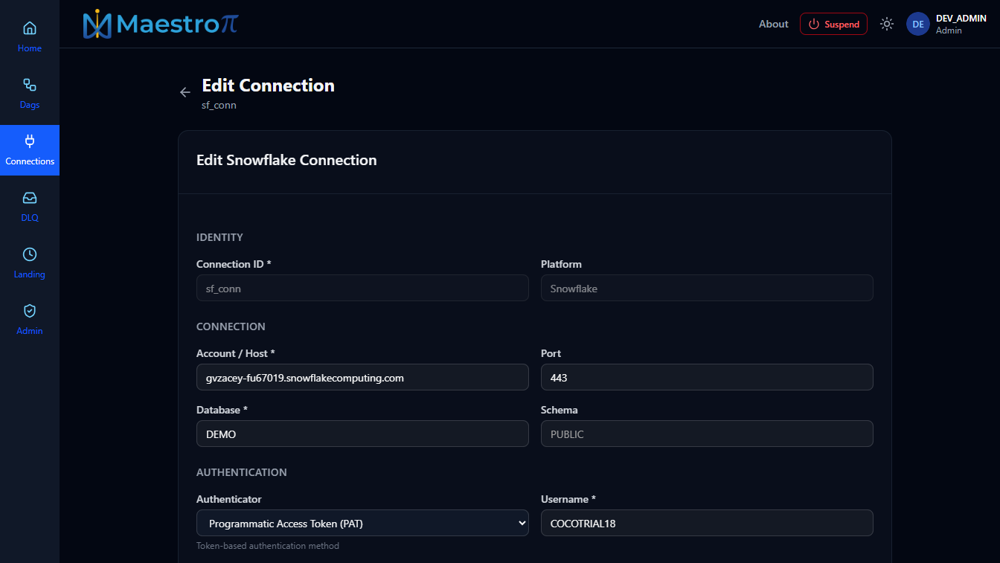

---

## 8. Dead Letter Queue (DLQ)

`/dlq` collects tasks that **failed permanently** — i.e. they exhausted all their configured
retries. Nothing here is retried automatically; it waits for a human decision.

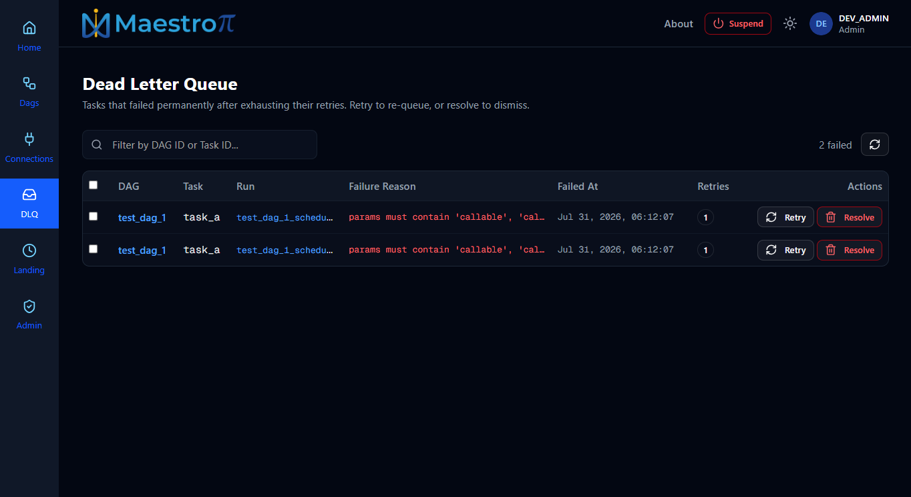

- **Filter box** — narrow by DAG ID or Task ID.
- **Retry** — re-queues that single task for another attempt.
- **Resolve** — dismisses the entry without retrying (use once you've handled it another way, or
  decided it doesn't matter).
- **Checkboxes + bulk Retry/Resolve** — act on many entries at once.

Clicking a DAG or Run link jumps straight to that [Run Detail Page](#5-dag-run-detail-page) for
more context on *why* it failed.

---

## 9. Landing Times

`/landing-times` answers "how long does it take runs to actually finish after they were
*supposed* to start?" — i.e. scheduling/latency drift, not task duration.

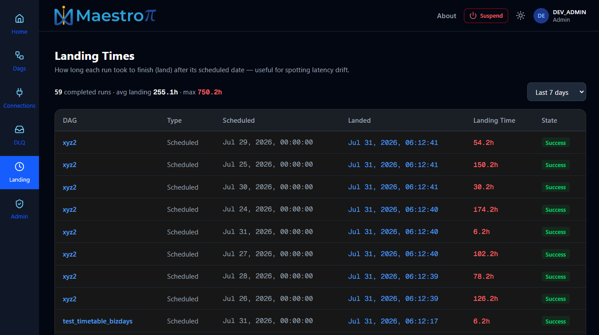

- **Range selector** (top right) — Last 24h / 3 / 7 / 14 / 30 days.
- **Summary line** — total completed runs, average landing time, and the worst (max) landing
  time in the selected window.
- **Table** — one row per completed run: when it was *scheduled* vs when it actually *landed*
  (finished), the delta between them (color-coded: green = fast, amber = moderate, red = slow),
  and its final state.

This is a good page to check periodically even when nothing looks "broken" — landing time
creeping upward over weeks is often the first sign of a resource or scheduling problem.

---

## 10. Admin & Permissions

`/admin` is visible only to users holding the `Admin` role. This is where you manage *who* can
use Maestro-π and *what* they're allowed to do.

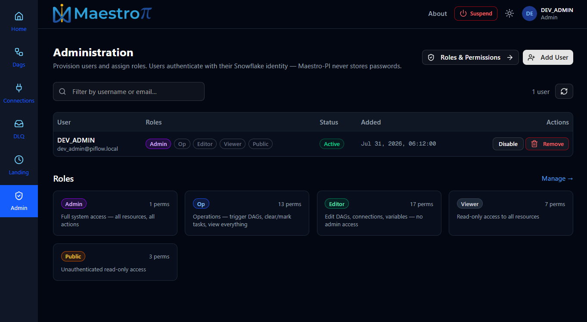

- **User table** — every provisioned user, their assigned roles (click a role badge to toggle it
  on/off for that user), active/disabled status, and when they were added.
- **Add User** — provisions a new Maestro-π user. You pick an existing **Snowflake** login (the
  dropdown searches your Snowflake account's users) — Maestro-π never stores a password; sign-in
  is always via Snowflake identity.
- **Disable / Remove** — Disable blocks sign-in without deleting the record; Remove deletes it
  outright (does not touch the underlying Snowflake account).
- **Roles overview** (bottom of page) — a quick-glance card per role; click one to manage it.

### Roles & Permissions

Click **Roles & Permissions →** for the full list:

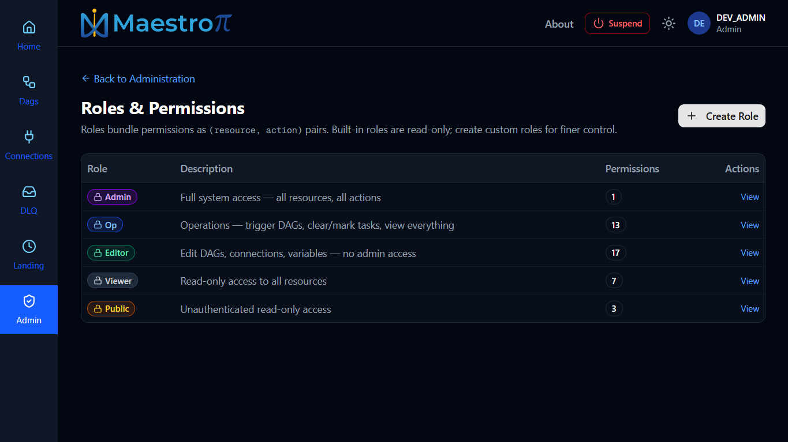

Five roles ship built-in (`Admin`, `Op`, `Editor`, `Viewer`, `Public`) and are **read-only** —
you can view what they grant but not edit them. Click **+ Create Role** to define a custom role
with its own permission set.

### Role permission matrix

Clicking any role (built-in or custom) opens its permission matrix — a grid of resources
(DAGs, DAG Runs, Tasks, Connections, Variables, Pools, System) against actions (view, edit,
trigger, delete, clear, mark, admin):

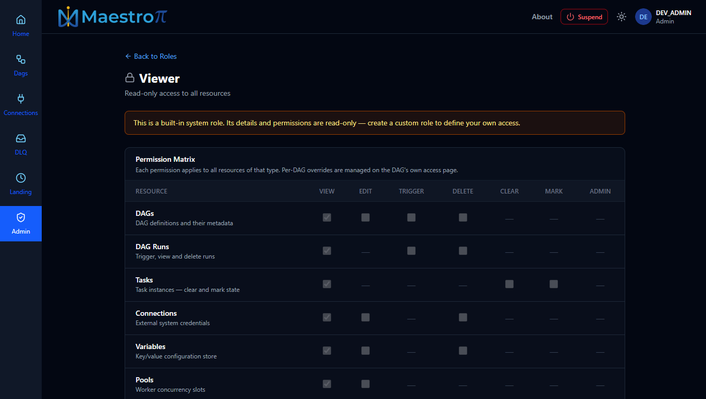

For built-in roles the checkboxes are locked (read-only, as noted on the page). For a custom
role, tick the boxes you want and click **Save permissions**. Remember: these are *role-level*
defaults — the per-DAG [Access tab](#access) can grant narrower, DAG-specific exceptions on top.

---

## 11. Assets (early / preview feature)

`/assets` lists **data assets** — named outputs that DAGs produce or consume, letting you trace
which workflows feed which datasets. There's no screenshot of this page in the set this guide
was built from, but structurally it's a table of asset names with "Consuming DAGs" and
"Producing Tasks" columns you can expand to jump to the relevant DAGs.

> **Heads up:** at the time of writing, this page is wired to placeholder/mock data rather than
> live data from the system — don't be alarmed if what you see here doesn't match your real
> DAGs yet. Treat it as a preview of a feature still being built out.

---

## 12. About

The **About** link in the top bar opens a simple info page: product name/version, a short
description of what Maestro-π is, and a link to PibyThree (the company behind the product).
Nothing actionable here — just reference info.

---

## 13. Roles cheat-sheet

A quick summary of what each built-in role can do, so you know what to expect (or request) as a
user:

| Role | What it can do |
|---|---|
| **Admin** | Everything — every resource, every action, including user/role management. |
| **Op** | Operational work: trigger DAGs, clear/mark task state, view everything. Cannot manage users/roles or edit DAG/connection definitions. |
| **Editor** | Edit DAGs, connections, and variables. No admin access (can't manage users or roles). |
| **Viewer** | Read-only access everywhere. Can look but not touch. |
| **Public** | Unauthenticated, read-only — the minimal baseline access. |

If a button or tab you expect to see is missing, it's almost always because your role doesn't
grant that permission — ask your Maestro-π Admin rather than assuming something's broken.

---

## 14. Not built yet

A few sidebar-adjacent routes exist as placeholders in the app today but have no page built
behind them yet: **Login** (not needed — Snowflake handles auth), **Cluster**, **Change
Password**, **Admin → API Keys**, and **Admin → Sessions**. If you land on one of these via a
direct link, that's expected for now, not a bug on your end.

---

*This guide reflects the Maestro-π UI as of the screenshots and codebase reviewed on 2026-07-31.
Screens may evolve — if something here looks noticeably different from what you see live, the
app has likely moved forward since this was written.*
