# Maestro-Pi UI Navigation Guide

Welcome to Maestro-Pi! This guide walks you through every screen in the Maestro-Pi
web UI — what you'll see, what each element on the page does, and the
actions you can take from it. Read it top to bottom if you're new, or jump
straight to the section for the screen you're looking at using the table of
contents below.

> **Signed in via Snowflake.** Maestro-Pi doesn't have its own sign-in form —
> authentication is handled entirely by Snowflake (SPCS ingress). You open the
> app already signed in as your Snowflake user, and Maestro-Pi reads that
> identity automatically. See [Signing In](#signing-in) for details.

---

## Table of Contents

- [Signing In](#signing-in)
- [Quick-Navigation-Bars](#application-shell)
- [Home](#home)
- [Dags](#dags)
  - [Dag Detail](#dag-detail)
  - [Dag Run Detail](#dag-run-detail)
- [Connections](#connections)
  - [Platform Connections](#platform-connections)
  - [New / Edit Connection](#new--edit-connection)
- [DLQ (Dead Letter Queue)](#dlq-dead-letter-queue)
- [Landing Times](#landing-times)
- [Admin](#admin)
  - [Users](#admin--users)
  - [Roles & Permissions](#admin--roles--permissions)
- [Permissions & Visibility](#permissions--visibility)

---

## Signing In

**Route:** none — signing in happens outside the app itself.

Authentication is delegated entirely to Snowflake. When you open the app
(from Snowsight or via the SPCS ingress URL), Maestro-Pi reads your
already-established Snowflake identity from `/api/auth/me` — there's no
username/password form to fill in.

While that identity is resolving, or if it can't be resolved, you'll see one
of these full-page states instead of the normal app UI:

- **Loading** — a centered spinner shown for a moment while Maestro-Pi calls
  `/api/auth/me`.
- **"Access not provisioned"** — shown when you're authenticated to Snowflake
  but your Snowflake user hasn't been added to Maestro-Pi yet. Ask a Maestro-Pi
  Admin to add you from [Admin → Users](#admin--users).
- **"Unable to verify identity"** — shown when Maestro-Pi can't determine your
  Snowflake identity at all (for example, running the frontend locally
  outside of the Snowflake ingress). Open the app from Snowflake instead.

### Common actions

- Nothing to do here under normal use — if you can reach the app at all,
  you're already signed in. If you land on "Access not provisioned," contact
  an Admin.

---

## Quick-Navigation-Bars

Once your identity resolves, every page in Maestro-Pi shares the same shell: a
left **icon sidebar** for getting around, and a top **navigation bar** for
theme and account info. Get familiar with these two pieces first — they stay
the same no matter which section of the app you're in.

### Left sidebar

A narrow icon rail, always visible, with the current page highlighted in
blue. From top to bottom:

| Label | Route | Purpose |
|---|---|---|
| Home | `/` | Dashboard with health + workflow stats |
| Dags | `/dags` | List and manage workflows |
| Connections | `/connections` | Manage external system credentials |
| DLQ | `/dlq` | Failed tasks parked in the dead letter queue |
| Landing | `/landing-times` | SLA / on-time landing report |
| Admin | `/admin` | Users, roles, permissions *(Admin role only)* |

### Top navigation bar

- **Maestro-Pi logo** (left) — click it to go Home
- **Theme toggle** (sun/moon icon) — switches light/dark mode
- **User avatar + username + role list** (right)

There's  no separate sign-out
button — since Snowflake owns your session, signing out happens through
Snowflake, not Maestro-Pi.

### Common actions

- Click any sidebar icon to navigate to that section — the active section is
  highlighted.
- Click the sun/moon icon to toggle dark mode.
- Click the logo to jump back to Home from anywhere.

---

## Home

**Route:** `/`

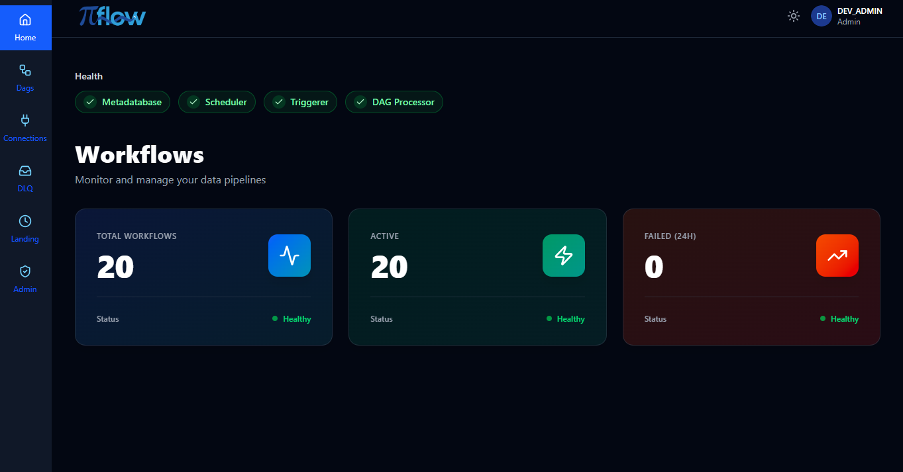

### Description :

The landing dashboard after your identity resolves — a quick-glance summary
of system health and overall workflow stats. It does not list individual
DAGs; use [Dags](#dags) for that.

### Key elements

- **Health** row — a dynamically-fetched list of component pills (typically
  **Scheduler**, **Triggerer**, **Dag Processor**, **Metadatabase**), each
  showing a check / cross / dash icon in a colored dot for
  healthy / unhealthy / unknown. This list refreshes automatically every 15
  seconds.

- Three stat cards:
  - **Total Workflows** — count of all DAGs
  - **Active** — DAGs that are not paused
  - **Failed (24h)** — DAGs whose last run failed within the last 24 hours

### Common actions

- Use this page as a quick health check before diving into [Dags](#dags) for
  details.

---

## Dags

**Route:** `/dags`

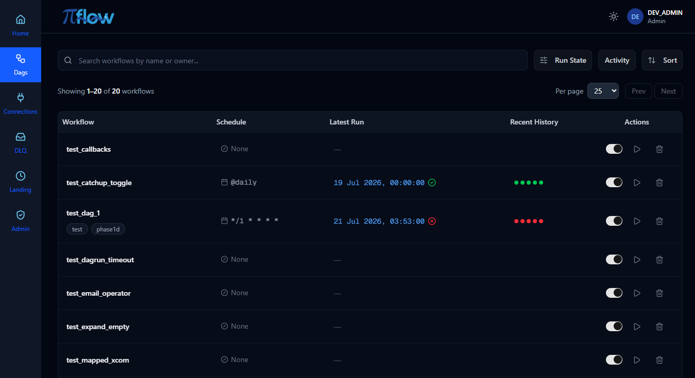

### Description :

The full list of workflows (DAGs) registered in Maestro-Pi, with search, filter,
sort, pagination, and per-row actions.

### Key elements

- **Search bar** — search by workflow name
- **State filter** — filter by last run state: `success`, `failed`,
  `running`, `queued`
- **Status filter** — filter by `Active` / `Paused`
- **Sort dropdown** — Name A-Z / Z-A, Last Run (newest/oldest)
- **"Showing X–Y of Z workflows"** count, with a **per-page** selector
  (25 / 50 / 100) and **Prev** / **Next** buttons
- **Table columns**:
  - **Workflow** — name (links to [Dag Detail](#dag-detail)) and tags
  - **Schedule** — cron expression (hover for a plain-English description),
    or "None" if the DAG has no schedule
  - **Latest Run** — timestamp + status icon, links to the DAG's detail page
  - **Recent History** — small visualization of recent run outcomes
  - **Actions** — pause/activate toggle, trigger (▶), and delete (🗑), each
    gated by permission

### Common actions

- To pause/activate a workflow, click the toggle in its row.
- To open a workflow's detail page, click its name.
- To manually trigger a run, click the ▶ icon (requires trigger permission)
  — this opens the **Trigger DAG modal** (see below).
- To delete a workflow, click the 🗑 icon — a confirmation dialog explains
  that this permanently removes the DAG's run history, task instances,
  XComs, and logs, and that the DAG will be re-created (with empty history)
  if its file still exists in the connected repository.
- To filter results, use the State or Status dropdowns, or type in the search
  box.
- To re-sort the list, use the Sort dropdown.

### Trigger DAG modal

Opened from the ▶ icon on the Dags list, or the **Trigger** button on
[Dag Detail](#dag-detail)'s header.

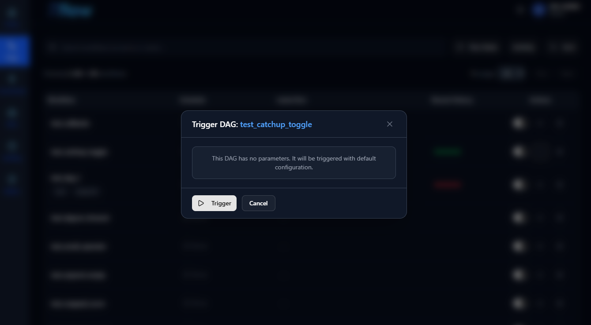

- If the DAG defines `params`, the modal fetches that schema and renders one
  input per parameter (text, integer, or boolean toggle), each with its
  description and a required-field indicator.
- A collapsible **Generated Configuration JSON** section previews the exact
  payload that will be sent.
- If the DAG has no params, the modal just confirms it will trigger with
  default configuration.
- Click **Trigger** to start the run, or **Cancel** to close without
  triggering.

---

### Dag Detail

**Route:** `/dags/[id]` (e.g. `/dags/my_etl_pipeline`)

### Description :

The detail page for a single workflow. A header card shows its identity and
lets you pause/trigger it; nine tabs below cover everything else — grid
history, metadata, run history, a calendar view, task definitions, the
dependency graph, source code, a manual diff tool, and per-DAG access
control.

### Header

- Workflow name, with a pause/active toggle next to it (if you have edit
  permission) and a **Trigger** button (if you have trigger permission) —
  opens the same [Trigger DAG modal](#trigger-dag-modal) as the Dags list.
- Meta grid: **Schedule** (with plain-English description), **Latest Run**
  (timestamp + status icon), **Next Run**, **Owner**, **Tags**, and
  **Latest Dag Version**.

### Tabs

**Grid** — an Airflow-style grid: tasks as rows, recent runs as columns,
each cell colored by that task instance's state.

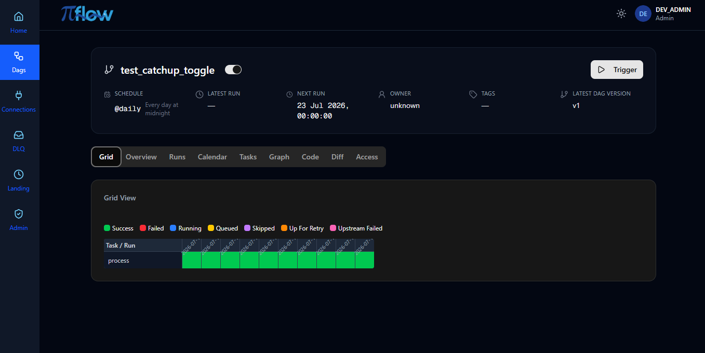

**Overview** — a details table (DAG ID, Status, Owner, Schedule, Latest
Version, Next Run, Start Date, File, Tags) plus the DAG's rendered
description/docs.

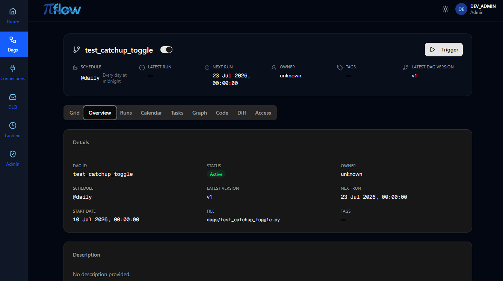

**Runs** — a paginated list of recent runs (run ID, start/end time,
duration, a **Params** badge when the run had a trigger config, relative
time, and a state badge). Click a run to open its
[Dag Run Detail](#dag-run-detail) page.

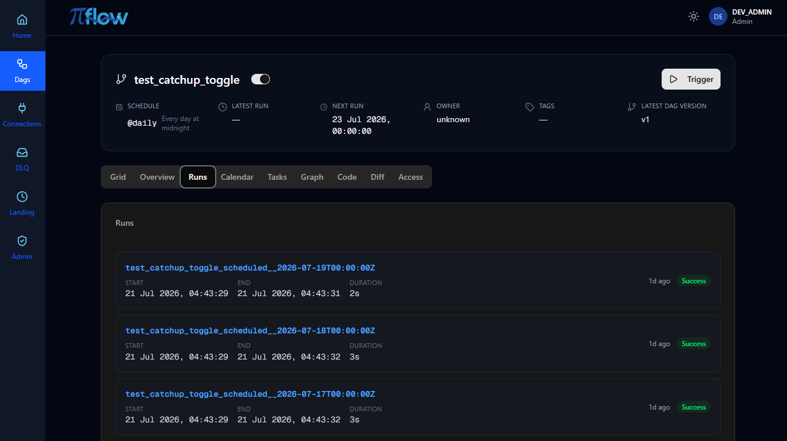

**Calendar** — a month calendar with runs plotted on the day they started,
color-coded by state; use the arrows to move between months.

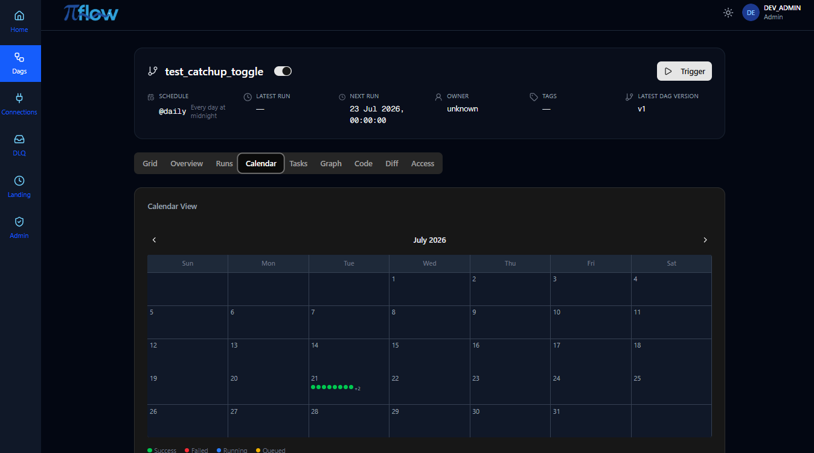

**Tasks** — every task defined in the DAG (task ID, operator, trigger
rule, retries, and its most recent instance's state).

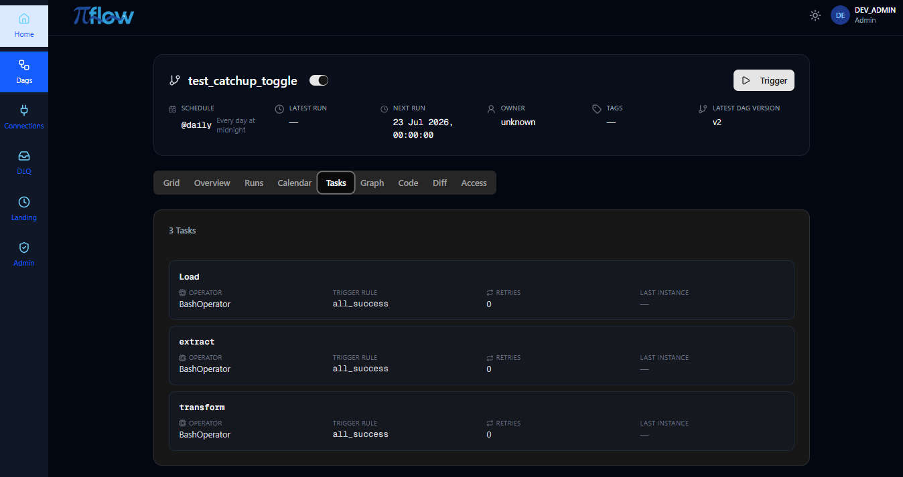

**Graph** — the static task dependency graph (no live run-state overlay —
that's on [Dag Run Detail](#dag-run-detail)'s Graph tab instead).

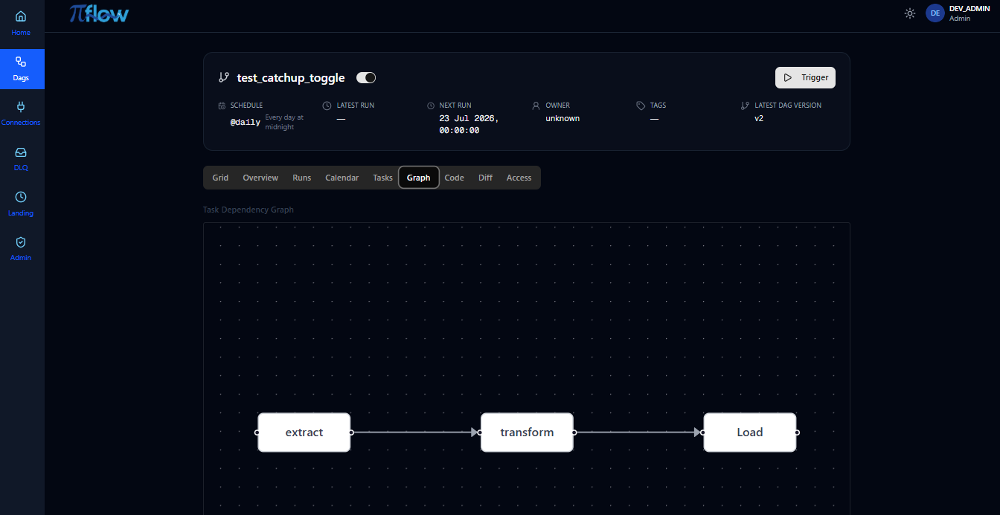

**Code** — syntax-highlighted DAG source, fetched from the connected
repository, with a **Theme** selector (oneDark / prism). Shown here in two
parts, since the full source view doesn't fit in a single screenshot:

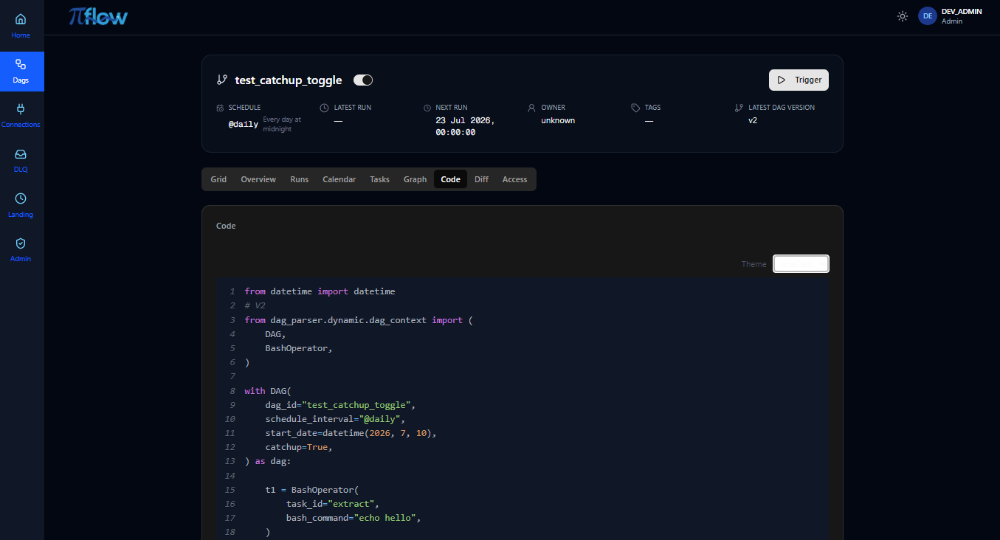
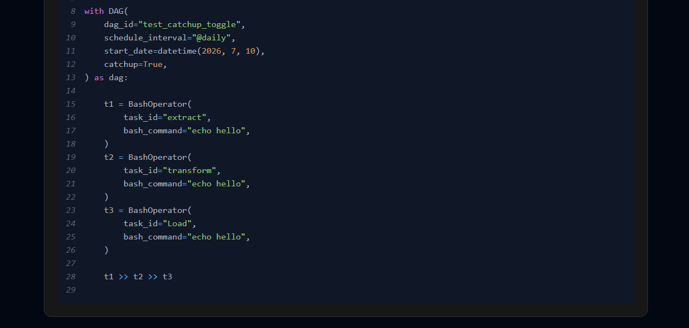

**Diff** — a manual code-diff tool: paste a previous version of the DAG
source into the textarea and click **Compare** to see a line-by-line diff
against the current code (with +added/-removed counts). There's also a
**Copy current** button.

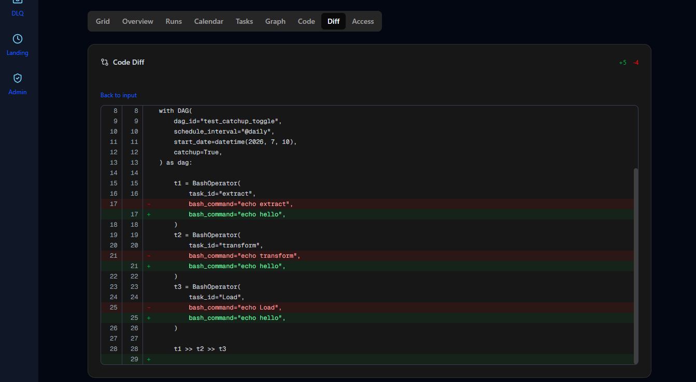

**Access** — per-DAG permission overrides, on top of role-level defaults:
a table of (Role, Action, Source) grants. Admins can add a grant (role +
action) or remove one; everyone else sees the table read-only.

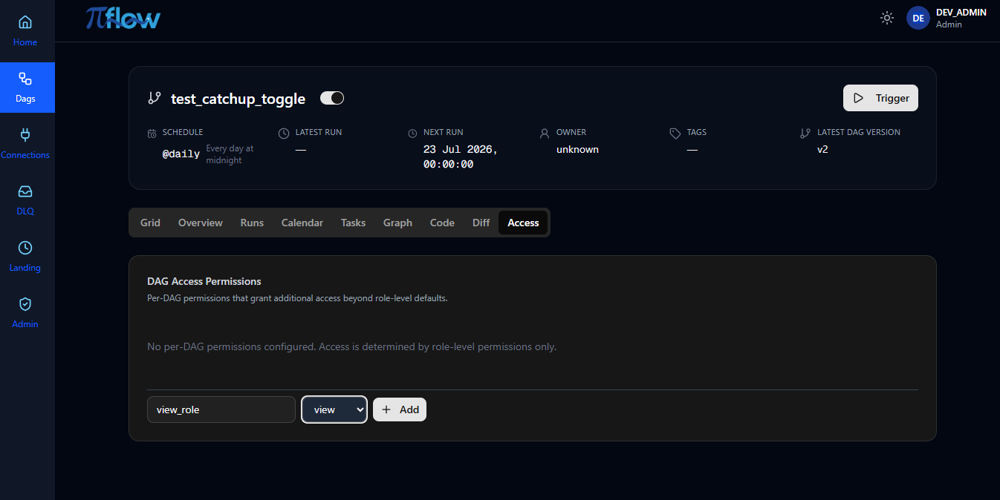

### Common actions

- Click a run in the **Runs** tab to open its [Dag Run Detail](#dag-run-detail)
  page.
- Click **Trigger** in the header to open the Trigger DAG modal.
- Switch tabs to change what you're looking at — most tabs load their data
  independently, so switching is fast after the first visit.

---

### Dag Run Detail

**Route:** `/dags/[id]/runs/[runId]`

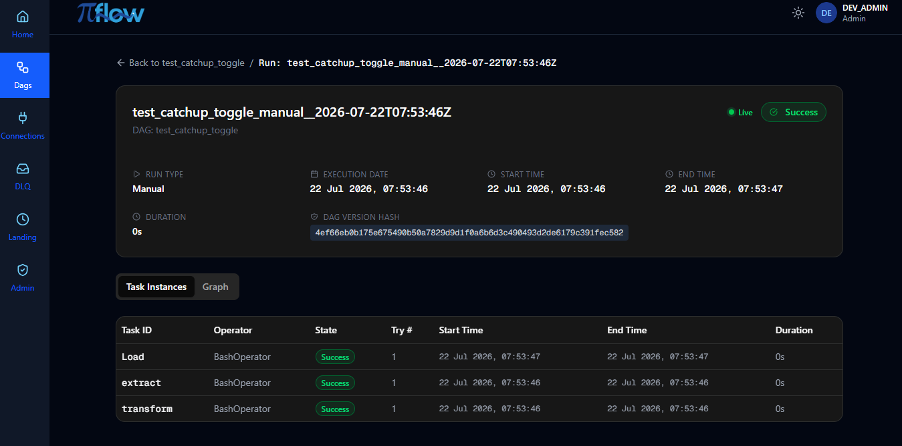
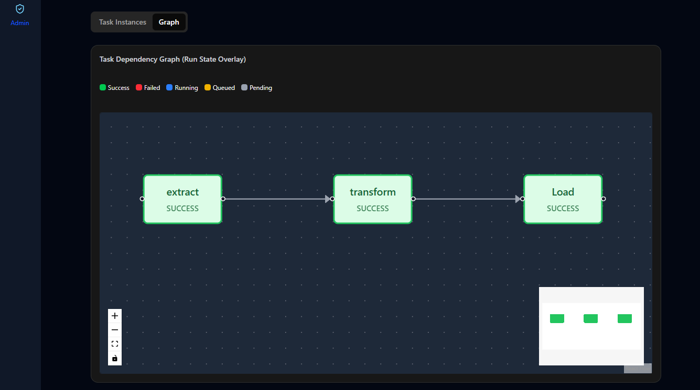
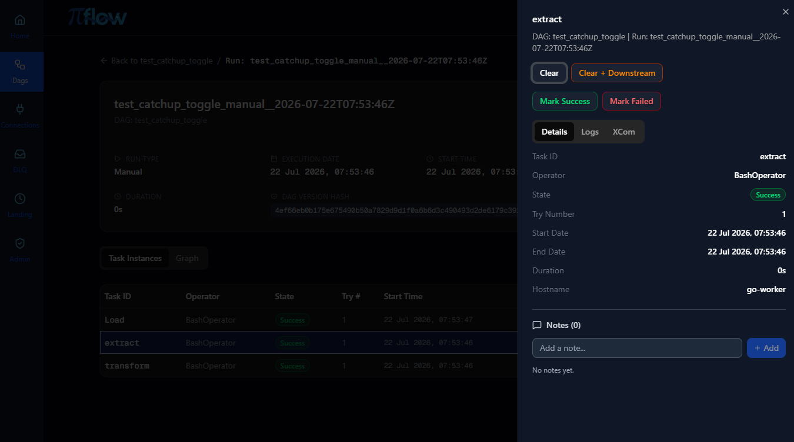

### Description :

A single execution ("run") of a workflow: its overall state, timing, and the
state of every task inside it. Task states update live for in-progress runs
(via WebSocket, with a 3-second polling fallback).

### Key elements

- **Breadcrumb** — "← Back to `<dag_id>`" / "Run: `<run_id>`"
- **Run header card**:
  - Run ID and parent DAG ID
  - **Live** indicator (green pulsing dot) when a WebSocket connection is
    streaming task state updates
  - Overall run **state** badge (success / failed / running / queued / …)
  - Run Type, Execution Date, Start Time, End Time, Duration
  - DAG Version Hash (if available)
- **Task Instances tab** — table of every task in the run: Task ID, Operator,
  State, Try #, Start/End Time, Duration. Clicking a row opens the **task
  detail panel**.
- **Graph tab** — the task dependency graph, with nodes colored by state
  (success/failed/running/queued/pending) and a color legend above it.
  Clicking a node opens the same task detail panel.

### Task Detail panel

Slides in from the right when you click a task row or graph node.

- **Action buttons** (each gated by permission): **Clear**,
  **Clear + Downstream**, **Mark Success**, **Mark Failed**.
- **Details tab** — task ID, operator, state, try number, start/end date,
  duration, hostname, and a **Notes** section underneath where anyone can
  leave timestamped comments on this specific task run.
- **Logs tab** — the task's log output for the selected try.
- **XCom tab** — any XCom values the task pushed, or a message if it pushed
  none.

### Common actions

- Click a row in **Task Instances** (or a node in **Graph**) to open its
  detail panel.
- In the detail panel, use **Clear** / **Clear + Downstream** to re-run a
  task, or **Mark Success** / **Mark Failed** to force its state.
- Switch between **Task Instances** and **Graph** tabs to change how you
  inspect the run.
- For a still-running run, watch the **Live** indicator and task states
  update automatically — no refresh needed.

---

## Connections

**Route:** `/connections`

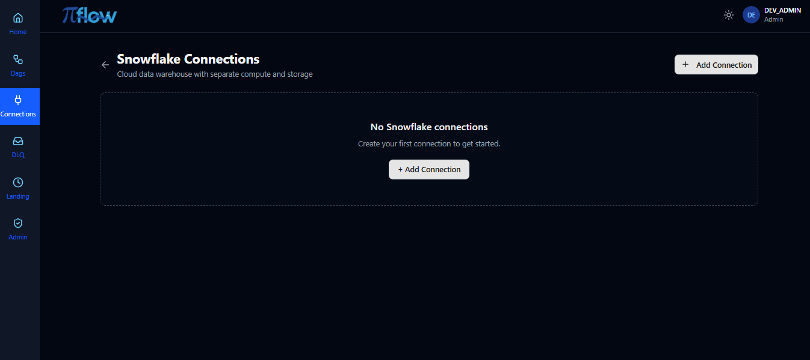

### Description :

An overview of every external system type Maestro-Pi can connect to (databases,
cloud storage, messaging, compute), grouped by category, with a count of
existing connections per type.

### Key elements

- Category sections: **Databases**, **Cloud Storage**, **Messaging**,
  **Compute** (others fall under a generic category)
- Platform cards — icon, name, short description, and a badge showing how
  many connections of that type already exist

### Common actions

- Click a platform card to see (and manage) all connections of that type — see
  [Platform Connections](#platform-connections).

---

### Platform Connections

**Route:** `/connections/[type]` (e.g. `/connections/snowflake`)

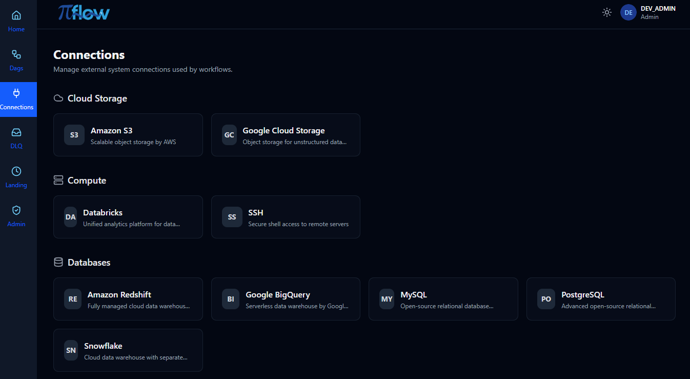

### Description :

All configured connections for one platform type (e.g. all Snowflake
connections).

### Key elements

- **← Back** arrow to Connections overview
- Platform name + description
- **Add Connection** button *(requires connection-edit permission)*
- Table: **Connection ID** (links to edit), **Host**, **Created**, **Actions**
  (test ⚡ and delete 🗑, delete gated by permission)
- Empty state with a call-to-action to create the first connection

### Common actions

- Click **Add Connection** to create a new connection of this type.
- Click a connection ID to edit it — see
  [New / Edit Connection](#new--edit-connection).
- Click the ⚡ icon to test a connection without opening it.
- Click the 🗑 icon to delete a connection (asks for confirmation).

---

### New / Edit Connection

**Routes:** `/connections/new` and `/connections/[type]/[id]`

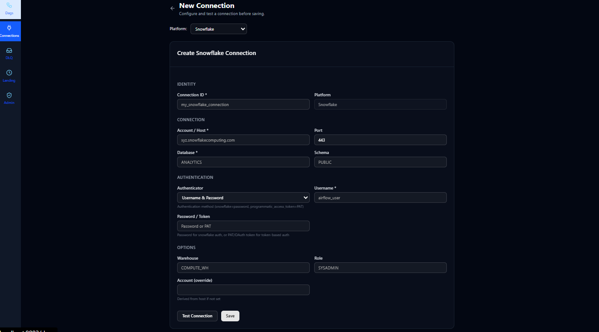

### Description :

A form to configure (create) or update (edit) a single connection. Fields are
generated dynamically based on the selected platform type.

### Key elements

- **Platform** selector (create mode only, when no type is pre-selected)
- **Identity** section — Connection ID (locked once created) and Platform
  (read-only)
- Dynamic field sections grouped by category, e.g. **Connection**,
  **Authentication**, **Options** — text, password, number, select, and
  textarea fields depending on what the platform requires
- **Test Connection** button — validates credentials without saving
- **Save** / **Save Changes** button

### Common actions

- Fill in the required fields (marked with `*`), click **Test Connection** to
  verify before saving.
- Click **Save** (create) or **Save Changes** (edit) to persist the
  connection.

---

## DLQ (Dead Letter Queue)

**Route:** `/dlq`

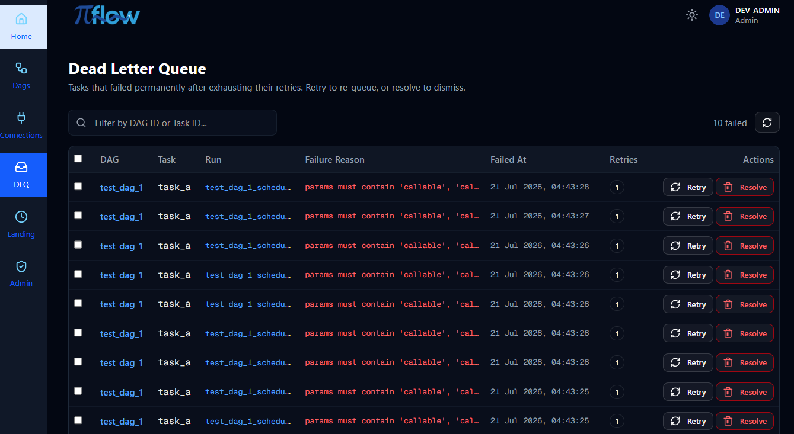

### Description :

Tasks that failed permanently after exhausting their retries — retry to
re-queue them, or resolve to dismiss, instead of digging through logs.

### Key elements

- **Filter by DAG ID or Task ID** search box
- Row **checkboxes** + a **select-all** checkbox in the header, and per-row
  / bulk **Retry** and **Resolve** actions — all of this is only shown to
  users with `system:admin` permission; everyone else sees a read-only table
- Bulk action bar (appears once rows are selected): **Retry**, **Resolve**
- Table columns: **DAG** (links to Dag Detail), **Task**, **Run** (links to
  Dag Run Detail), **Failure Reason**, **Failed At**, **Retries**, and
  **Actions**
- Pagination controls at the bottom

### Common actions

- To retry a single failed task, click **Retry** on its row.
- To mark a failure as handled without retrying, click **Resolve**.
- To act on many entries at once, check their boxes and use the bulk
  **Retry** / **Resolve** buttons in the toolbar.
- Use the filter box to narrow the list to a specific DAG or task.

---

## Landing Times

**Route:** `/landing-times`

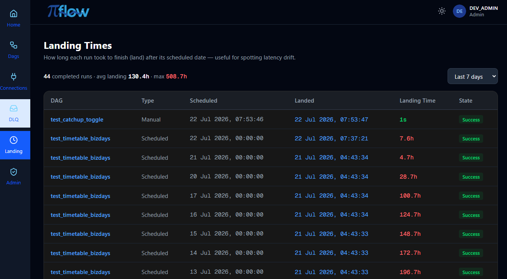

### Description :

How long each run took to finish (land) after its scheduled date — useful
for spotting latency drift. The landing time itself is color-coded by rough
magnitude rather than sorted into fixed on-time/late buckets.

### Key elements

- **Time range selector** — Last 24h / 3 days / 7 days / 14 days / 30 days
- A summary line above the table: number of completed runs in range, average
  landing time, and max landing time
- Table columns: **DAG** (links to Dag Detail), **Type** (run type),
  **Scheduled** (execution date), **Landed** (links to the specific
  [Dag Run Detail](#dag-run-detail) page), **Landing Time** (color-coded:
  green under 5 min, amber under 15 min, red beyond that), and **State**

### Common actions

- Change the time range dropdown to widen or narrow the reporting window.
- Scan the **Landing Time** column for red entries to spot the slowest-landing
  runs.
- Click a DAG name or a landed time to jump straight to that run.

---

## Admin

**Route:** `/admin` — visible only to users with the **Admin** role. See
[Permissions & Visibility](#permissions--visibility).

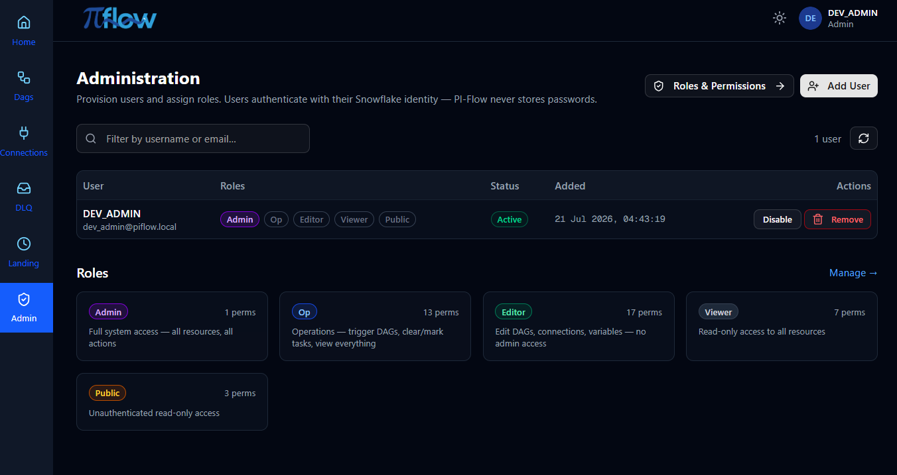

### Description :

Provisioning: since Maestro-Pi never stores passwords, "creating a user" here
means picking an existing Snowflake user and granting them roles so they can
sign in and use Maestro-Pi. A quick link at the top jumps to Roles & Permissions.

### Key elements

- Quick link: **Roles & Permissions →**
- **Add User** button, expanding a form:
  - **Snowflake user** — a searchable combobox listing real Snowflake
    account users not yet provisioned in Maestro-Pi (falls back to a free-text
    login-name field if the live Snowflake user list can't be reached)
  - **Email** (optional, used only for alert notifications)
  - **Assign roles** — a grid of role cards to toggle on/off
- Users table: **User** (username + email), **Roles** (click a role pill to
  toggle it on/off for that user), **Status** (Active/Disabled), **Added**
  (date), and **Actions** (**Enable**/**Disable**, **Remove**)
- **Roles** summary cards below the table (name, description, permission
  count), linking into [Roles & Permissions](#admin--roles--permissions)

### Common actions

- Click **Add User**, search for and pick a Snowflake user, optionally
  assign roles, and click **Create user**. They can sign in immediately with
  their Snowflake identity — no password to set.
- Click a role pill on a user's row to grant/revoke that role.
- Click **Disable** to deactivate an account without deleting it, or
  **Remove** to drop it from Maestro-Pi permanently (their Snowflake account is
  unaffected either way).

---

### Admin → Roles & Permissions

**Route:** `/admin/roles`

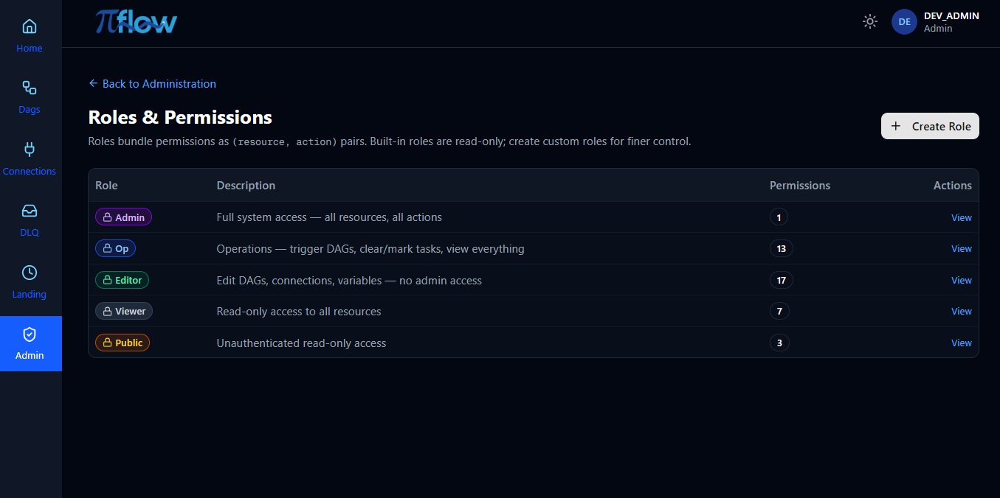

### Key elements

- **← Back to Administration** link
- **Create Role** button and inline form (name, description)
- Roles table: Name, Description, Permission count, and a **View/Edit**
  link (default roles — Admin, Op, Editor, Viewer, Public — are view-only
  and can't be deleted)

### Common actions

- Click **Create Role** to define a new custom role.
- Click **Edit** on a custom role to open its permission matrix.
- Click **Delete** on a custom role to remove it (default roles have no
  delete option).

---

**Route:** `/admin/roles/[id]`

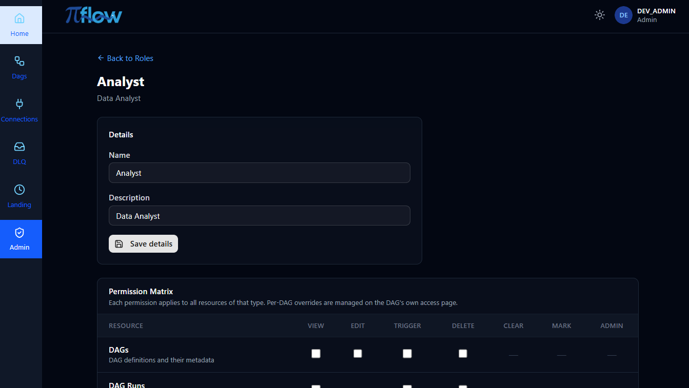
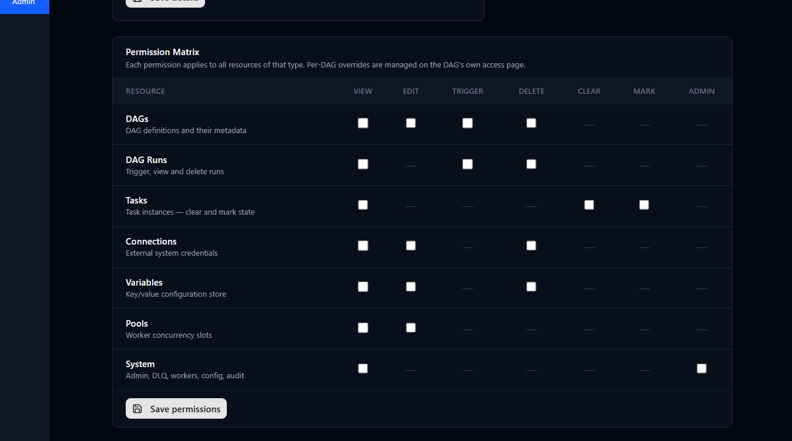

### Key elements

- Role **Name** / **Description** fields (disabled for default roles, which
  show a "read-only, built-in role" notice instead)
- **Permission Matrix** — resources (`dag`, `dag_run`, `task`, `connection`,
  `variable`, `pool`, `system`) as rows, actions (`view`, `edit`, `trigger`,
  `delete`, `clear`, `mark`, `admin`) as columns; only applicable
  action/resource combinations show a checkbox. Clicking a resource's name
  toggles all of its applicable actions at once.
- **Save details** / **Save permissions** buttons (hidden for default roles)

### Common actions

- Check/uncheck cells in the matrix to grant or revoke a specific
  permission, then click **Save permissions**.
- Click a resource name (e.g. "DAGs") to toggle every action for that row on
  or off in one click.

---

## Permissions & Visibility

Not every signed-in user sees the same sidebar or the same actions:

- The **Admin** sidebar icon only appears for users with the `Admin` role.
  Navigating directly to an Admin route without that role shows a full-page
  "Access denied" screen with a link back to Dags, instead of the page
  content.
- The **Connections** sidebar icon requires `connection:view` permission.
- Within pages, individual controls are gated by fine-grained permissions,
  e.g.:
  - Triggering a DAG run requires `dag:trigger`
  - Editing/pausing a DAG requires `dag:edit`
  - Deleting a DAG requires `dag:delete`
  - Clearing/marking a task instance requires `task:clear` / `task:mark`
  - Managing DLQ entries requires `system:admin`
  - Creating/deleting connections requires `connection:edit` /
    `connection:delete`
  - Editing per-DAG access grants (on the Dag Detail **Access** tab)
    requires the `Admin` role

If a button, toggle, or menu item described in this guide is missing for you,
it's most likely a permissions difference — check with an Admin user via
[Admin → Roles & Permissions](#admin--roles--permissions).
